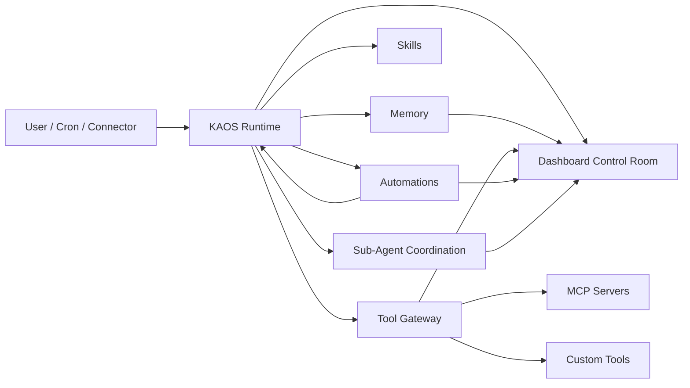

# Kronos Agent OS (KAOS)

[](https://github.com/spyrae/kronos-agent-os/actions/workflows/ci.yml)
[](https://pypi.org/project/kronos-agent-os/)
[](https://pypi.org/project/kronos-agent-os/)
[](LICENSE)
[](pyproject.toml)

Self-hosted runtime for durable AI agents that remember, use skills, call MCP tools, run scheduled work, and coordinate optional sub-agents.

KAOS is an agent operating layer:


- **Runtime**: local agent loop with CLI, Telegram, Discord, webhook, and cron entry points.
- **Memory**: session history, FTS5 recall, Mem0 vectors, knowledge graph, and sleep-time consolidation.
- **Skills**: workspace-local procedures and references the agent can load on demand.
- **Tool gateway**: MCP tools, custom tools, browser tools, and audit-friendly execution.
- **Automations**: scheduled jobs for digests, monitoring, analytics, and self-improvement.
- **Control room**: dashboard/API surfaces for memory, jobs, tool calls, and system status.
- **Coordination**: optional sub-agent and swarm mode with SQLite arbitration.

The default public posture is local-first and conservative: dynamic tools, dynamic MCP server management, and SSH/server operations are disabled unless explicitly enabled.

## Quickstart

Requirements:

- Python 3.11+
- Node.js 18.18+ for the optional dashboard UI

Install from PyPI:

```bash
pip install kronos-agent-os
kaos demo
```

`kaos demo` runs offline, no LLM key needed. To go further:

```bash
kaos doctor
kaos init personal-operator --role "personal operator for research and tasks"
# edit ~/.kaos/.env or your project .env: at least one real LLM key, or Ollama/local
```

For development or to track `main`:

```bash
git clone https://github.com/spyrae/kronos-agent-os.git
cd kronos-agent-os

python3 -m venv .venv
source .venv/bin/activate
pip install -e ".[dev]"

kaos demo
cp .env.example .env
kaos doctor
```

Bring your own LLM by editing `.env`. The default chain is Fireworks/Kimi plus
DeepSeek, but OpenAI, OpenRouter, Groq, Together, LiteLLM, Ollama, and arbitrary
OpenAI-compatible endpoints can be configured without code changes. See
[LLM Providers](docs/LLM_PROVIDERS.md).

If you work on the dashboard UI, run `nvm use` from the repository root before
`npm install` in `dashboard-ui/`.

For memory features:

```bash
pip install -e ".[dev,memory]"
```

For ASO automation:

```bash
pip install -e ".[dev,aso]"
```

For Telegram:

```bash
python scripts/auth-userbot.py
python -m kronos
```

Docker quickstart starts the safe local dashboard/control room:

```bash
cp .env.example .env
docker compose up --build
```

The Compose ports bind to `127.0.0.1` on the host. The full Telegram/webhook runtime is still `python -m kronos` after credentials are configured.

Dashboard demo state for screenshots and local demos:


```bash
kaos demo-seed --reset
AGENT_NAME=demo DB_DIR=data/demo DB_PATH=data/demo/session.db SWARM_DB_PATH=data/demo/swarm.db WORKSPACE_PATH=workspaces/demo kaos dashboard
```

The seeded data is deterministic and public-safe: no private Telegram IDs, live memories, tokens, or personal workspace names.

## Mental Model



Sub-agent coordination is one subsystem inside KAOS. Each agent can run as a separate process with its own persona, workspace, Telegram account, and local memory while sharing a SQLite coordination ledger.

## Core Commands

```bash
kaos --version       # print installed KAOS version
kaos doctor          # validate local setup and safety defaults
kaos init <name>     # create a local agent workspace
kaos demo            # offline walkthrough, no LLM key required
kaos chat            # local CLI chat without Telegram
kaos chat -p "..."   # one-shot local message
kaos chat --no-memory # local chat without long-term memory
kaos chat --tools    # local CLI chat with configured static MCP tools
kaos dashboard       # start the local dashboard API/UI
kaos demo-seed --reset # seed public-safe dashboard demo data
kaos connect telegram # guided Telegram setup check
kaos templates list  # list bundled agent templates
kaos skills packs    # list bundled skill packs
python -m kronos     # run the Telegram/webhook runtime
```

`kaos demo` is deterministic and runs without Telegram, Docker, or provider keys. Use `kaos demo --live` when you want the same safety gates with a real LLM-backed chat. Demo mode forces conservative defaults for dynamic tools, dynamic MCP, and server ops even if the local environment enables them.

## Configuration

Copy `.env.example` to `.env`. Minimum useful local setup:

```bash
FIREWORKS_API_KEY=fw_...      # or DEEPSEEK_API_KEY
AGENT_NAME=kronos             # uses workspaces/kronos/
```

Telegram requires:

```bash
TG_API_ID=12345678
TG_API_HASH=abc123...
ALLOWED_USERS=123456789       # comma-separated Telegram user IDs
ALLOW_ALL_USERS=false         # keep false unless this is a private/trusted account
```

Public-safe capability gates:

```bash
ENABLE_DYNAMIC_TOOLS=false
REQUIRE_DYNAMIC_TOOL_SANDBOX=true
ENABLE_MCP_GATEWAY_MANAGEMENT=false
ENABLE_DYNAMIC_MCP_SERVERS=false
ENABLE_SERVER_OPS=false
```

Enable risky capabilities only in trusted local deployments where you understand the tool surface.

## Create Your First Agent

KAOS ships the runtime, templates, and skill packs. You bring the domain.

```bash
kaos templates list
kaos templates install personal-operator personal-demo --force
kaos skills packs
kaos skills install-pack productivity --agent personal-demo --force

AGENT_NAME=personal-demo kaos doctor
AGENT_NAME=personal-demo kaos chat
```

Then edit `workspaces/personal-demo/self/IDENTITY.md`, add domain-specific
skills under `workspaces/personal-demo/self/skills/`, and connect MCP tools as
needed.

## Project Structure

```text
kronos/
  engine.py            # custom ReAct loop
  graph.py             # main runtime pipeline
  bridge.py            # Telethon transport
  cli.py               # kaos doctor/chat/demo
  group_router.py      # group routing and addressing
  swarm_store.py       # SQLite swarm ledger and claim arbitration
  config.py            # Pydantic settings
  agents/              # specialized sub-agents
  memory/              # Mem0, FTS5, knowledge graph, context engine
  skills/              # skill loading and approval tools
  tools/               # MCP, browser, dynamic, server ops, custom tools
  cron/                # scheduled jobs
dashboard/             # API/backend dashboard surfaces
dashboard-ui/          # web control room UI
workspaces/
  _template/           # public starter workspace for kaos init
  <agent>/             # local runtime state, gitignored
templates/
  agents/              # bundled safe agent profiles
  skill-packs/         # bundled reusable skill packs
docs/                  # docs index, runtime, memory, skills, MCP, automations, coordination
```

## Sub-Agents And Swarm Mode

KAOS Swarm Mode is the optional multi-agent coordination layer inside the broader Agent OS.

- Agents observe the same group message independently.
- Tier-based routing decides whether an agent should respond.
- SQLite `IMMEDIATE` transactions prevent duplicate implicit replies.
- Peer reactions let agents disagree or add perspective without polluting long-term memory.

This is useful for multi-persona group chats and expert panels, but the default KAOS runtime also works as a single durable agent.

## Safety

KAOS can connect to tools, memory, external services, and scheduled jobs. The public defaults are intentionally conservative:

- Dynamic Python tools are disabled by default.
- Dynamic MCP add/remove/reload is disabled by default.
- Persisted dynamic MCP servers are not loaded by default.
- SSH/server operations are disabled by default.
- Dynamic tool execution requires a Docker sandbox by default.
- Telegram DMs are blocked until `ALLOWED_USERS` is set, unless `ALLOW_ALL_USERS=true`.

For local dynamic-tool experiments, build the sandbox image first:

```bash
scripts/build-sandbox.sh
ENABLE_DYNAMIC_TOOLS=true kaos doctor
```

See [docs/SECURITY.md](docs/SECURITY.md) and [SECURITY.md](SECURITY.md).

## Documentation

- [Roadmap](ROADMAP.md)
- [Landing Page Content](docs/LANDING.md)
- [LLM Providers](docs/LLM_PROVIDERS.md)
- [Demo](docs/DEMO.md)
- [Personal Operator Demo](docs/PERSONAL_OPERATOR_DEMO.md)
- [Swarm Mode Demo](docs/SWARM_DEMO.md)
- [Launch Copy](docs/LAUNCH_COPY.md)
- [v0.1.0 Release Notes Draft](docs/RELEASE_NOTES_v0.1.0.md)
- [Architecture](docs/ARCHITECTURE.md)
- [Security](docs/SECURITY.md)
- [Dashboard](docs/DASHBOARD.md)
- [Memory](docs/MEMORY.md)
- [Skills](docs/SKILLS.md)
- [Cron Jobs](docs/CRON-JOBS.md)
- [Deployment](docs/DEPLOYMENT.md)

## License

MIT
